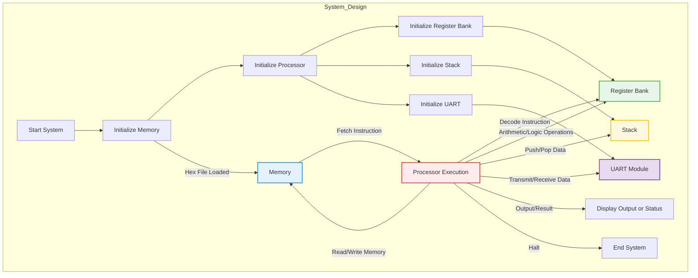
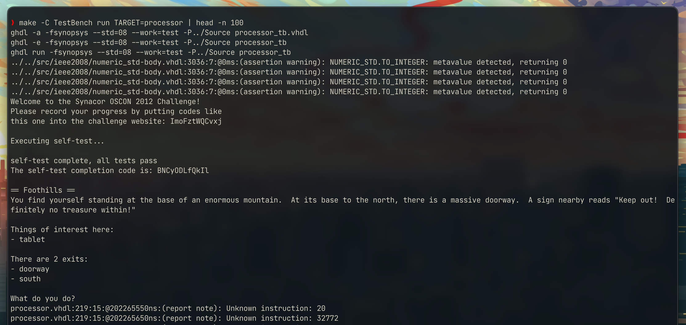

---
# Document
title: VM in hardware - Embedded System 
date: January, 2025
author: Aleksandr Pokatilov, Jurijs Zuravlovs
lang: en-GB
toc: true
toc-depth: 1
# References
csl: ieee.csl
bibliography: references.bib
link-citations: true
link-bibliography: true
# Meta
colorlinks: true
reference-links: true
output: pdf_document
documentclass: report
papersize: a4paper
geometry:
- top=2cm
- left=2cm
- right=2cm
- bottom=2cm
---

## 1. Purpose of the System

The goal of this project is to design a virtual machine (VM) processor using VHDL (VHSIC Hardware Description Language) that can execute a set of instructions to run a basic text-based adventure game. This project is inspired by the [Synacor VM Challenge](https://github.com/Aneurysm9/vm_challenge/tree/main), which challenges participants to create a processor capable of running a virtual machine for an adventure game. By combining our skills, we aimed to implement an embedded system that could perform these tasks and showcase our understanding of embedded system design.

This is `Top Level` diagram of the system architecture:


## 2. System Components Overview

The project is divided into several main components, each implemented as a separate VHDL file. Below is an overview of each component and its purpose:



### 2.1 Explanation of the Flowchart

1. **Initialization Phase**:
   - The system initializes all components: memory, processor, register bank, stack, and UART.
   - Memory is loaded from a hex file, which sets up initial data.
   - The UART module is prepared to handle serial communication.

2. **Processor Execution**:
   - The processor fetches instructions from memory, decodes them, and executes the required operations.
   - It interacts with the register bank for temporary storage, the stack for managing function calls or temporary data, and the UART for transmitting or receiving data.

3. **Component Interactions**:
   - **Memory**: Provides instructions and stores data.
   - **Register Bank**: Handles temporary data storage for arithmetic and logic operations.
   - **Stack**: Manages data for function calls and supports push/pop operations.
   - **UART**: Facilitates serial communication, receiving input from a terminal and transmitting output.

4. **Output**:
   - After execution, results are displayed or sent via the UART module. The system ends when a `Halt` instruction is encountered.

## 3. Extended Description

### 3.1 Memory (`memory.vhdl`)

This file implements the main memory component, which stores instructions and data for the processor. The memory is addressed using a 16-bit address bus, and data is read or written based on control signals. Here’s an example of how memory read and write operations are managed:

#### Entity Declaration

```vhdl
-- memory.vhdl
entity memory is
  generic (
    -- Name of the hex file to load
    file_name  : string := "memory.hex";
     -- Address size in bits
    addr_width : integer := 16;
    -- Data size in bits
    data_width : integer := 16 
  );
  port (
    -- Memory address input
    address  : in  integer range 0 to 2 ** addr_width - 1; 
    -- Data to write
    data_in  : in  std_logic_vector(data_width - 1 downto 0); 
    -- Data to read
    data_out : out std_logic_vector(data_width - 1 downto 0);
    we       : in  std_logic;  -- Write enable
    rst      : in  std_logic;  -- Reset signal
    clk      : in  std_logic   -- Clock signal
  );
end;

```

#### Architecture Definition

```vhdl
-- memory.vhdl
-- Define a memory array type
architecture memory_arch of memory is
  type MemoryT is array(0 to 2 ** addr_width - 1) of std_logic_vector(data_width - 1 downto 0);              
  -- Stores initial memory values
  signal mem : MemoryT; 
  -- Active memory for read/write operations
  signal mem2 : MemoryT; 
begin
```

- MemoryT: Defines an array of memory words with std_logic_vector values of width data_width.
- mem: Used to store the initial memory values loaded from the hex file.
- mem2: Operates as the main memory during execution, allowing read and write operations.

#### Initialization Process

The init process loads data from a hex file into the mem array.

```vhdl
-- memory.vhdl
  -- Process to initialize memory from a hex file
  init : process
    -- Open the hex file in read mode
    file file_handler : text open read_mode is file_name;  
    -- Variable to hold each line from the file
    variable line_number : line;
    -- Memory index for loading data                          
    variable i : integer := 0;               
    -- Variable to store hex string              
    variable hex_string : string(1 to data_width / 4);     
    -- Converted binary data
    variable hex_value : std_logic_vector(data_width - 1 downto 0); 
```

- `file_handler:` Opens the specified file (file_name) for reading.
- `hex_string:` Temporarily holds hex strings read from the file.
- `hex_value:` Converts hex_string into a std_logic_vector format.

The hex2slv function converts a hexadecimal string to a std_logic_vector, facilitating loading data from the hex file.

- Purpose: Maps each hex character ('0' to 'F') to a 4-bit binary representation.

```vhdl
    -- Function to convert hex string to std_logic_vector
    function hex2slv(hex_string : string) return std_logic_vector is
      -- Variable to hold the binary result
      variable result : std_logic_vector(hex_string'length * 4 - 1 downto 0) := (others => '0');
      -- Index to iterate through hex characters
      variable index : integer := 0;                      
    begin
      -- Loop through each hex character
      for j in hex_string'reverse_range loop          
        -- Check the hex character   
        case hex_string(j) is                              
          when '0' => result(index * 4 + 3 downto index * 4) := "0000";
          when '1' => result(index * 4 + 3 downto index * 4) := "0001";
          when '2' => result(index * 4 + 3 downto index * 4) := "0010";
          ...
          -- Error for invalid characters
          when others => report "Invalid hexadecimal character" severity error; 
        end case;
        -- Move to the next hex character
        index := index + 1;                               
      end loop;
      -- Return the binary result
      return result;                                      
    end function;
```

#### Reading and loading data

- Loop: Reads each line in the file, converts hex to binary, and stores it in mem.
- hex2slv usage: Converts each hex string segment into std_logic_vector to initialize mem.

```vhdl
 -- Loop through the hex file to read and initialize memory
    while not endfile(file_handler) loop
      -- Read a line from the hex file
      readline(file_handler, line_number);
      -- Read the hex string              
      read(line_number, hex_string);                     
      -- Convert first 2 hex chars to binary
      hex_value(7 downto 0) := hex2slv(hex_string(1 to 2)); 
      -- Convert next 2 hex chars to binary
      hex_value(15 downto 8) := hex2slv(hex_string(3 to 4)); 
      -- Store the binary data in memory
      mem(i) <= hex_value;               
      -- Increment the memory index                
      i := i + 1;                                        
    end loop;
    -- Close the hex file
    file_close(file_handler); 
    -- End the process                           
    wait;                                                
  end process;
```

#### Memory Process

- Reset (`rst`): Resets mem2 to initial values stored in mem upon activation.
- Write Enable (`we`): Allows data to be written to the specified address in mem2 when active.
- Data Output (`data_out`): Continuously outputs data from mem2 at the specified address.

```vhdl
  -- Process for handling memory read/write operations
  main : process(clk)
  begin
    if (rst = '0') then                            -- Check if reset signal is active
      mem2 <= mem;                                 -- Reset active memory to initial values
    elsif rising_edge(clk) and we = '1' then       -- On rising clock edge and write enabled
      mem2(address) <= data_in;                    -- Write input data to memory
    end if;
  end process;

  -- Output the data at the specified address
  data_out <= mem2(address);                       -- Assign the data from memory to output
end architecture memory_arch;
```

### 3.2. Processor (`processor.vhdl`)

The `processor.vhdl` file defines a processor capable of executing instructions by fetching them from memory, decoding their operation, executing the appropriate logic, and managing state transitions. It interacts with a register bank and a stack, supporting operations like arithmetic, logic, memory read/write, and control flow. This architecture implements a state machine to manage instruction execution. Here’s an example of an instruction fetch and decode cycle:

#### Entity declaration

```vhdl
-- processor.vhdl
entity processor is
  generic (
    data_width : integer := 16;  -- Data width (16 bits)
    addr_width : integer := 15   -- Address width (15 bits)
  );
  port (
    data_in  : in  std_logic_vector(data_width - 1 downto 0); -- Data input
    address  : out integer range 0 to 2 ** addr_width - 1;    -- Memory address output
    data_out : out std_logic_vector(data_width - 1 downto 0); -- Data output
    we       : out std_logic;                                -- Write enable
    rst      : in  std_logic;                                -- Reset signal
    clk      : in  std_logic                                 -- Clock signal
  );
end processor;
```

 Define a processor module with interfaces for memory (data_in, data_out, address, we) and control signals (rst, clk).

#### Architecture overview

 ```vhdl
architecture processor_arch of processor is
  subtype Data is Std_Logic_Vector(data_width - 1 downto 0);
  type StateT is (Fetch, Halt, Set, Add, Mult, Jmp, Out1, ...);
  signal state : StateT := Fetch; -- Processor starts in Fetch state
  signal pc    : Data;           -- Program counter
  signal reg_data : Data;        -- Register data for operations
  signal stack_top : Data;       -- Stack top for stack operations
  signal mem_we, stack_we, reg_we : Std_Logic := '0'; -- Control signals
begin 
 ```

#### Register Bank and Stack Components

 ```vhdl
component register_bank
  generic (
    bank_size  : integer;
    data_width : integer
  );
  port (
    addr     : in integer range 0 to bank_size - 1;
    data_in  : in std_logic_vector(data_width - 1 downto 0);
    data_out : out std_logic_vector(data_width - 1 downto 0);
    we       : in std_logic;
    rst      : in std_logic;
    clk      : in std_logic
  );
end component;

component stack
  generic (data_width : Positive);
  port (
    data_in  : in  std_logic_vector(data_width - 1 downto 0);
    data_out : out std_logic_vector(data_width - 1 downto 0);
    pop      : in  std_logic;
    we       : in  std_logic;
    clk      : in  std_logic;
    rst      : in  std_logic
  );
end component;
 ```

Manages data storage and retrieval for arithmetic and logic operations.  Handles function calls and temporary data storage.

#### State machine

Implements a state machine to handle instruction execution.

- Fetch: Fetches the next instruction from memory.
- Halt: Stops processor execution.
- Add, Mult: Perform arithmetic operations.
- Jmp: Modifies the program counter for jumps.

```vhdl
main : process(clk, rst)
begin
  if rst = '0' then
    state <= Fetch;          -- Reset state to Fetch
    pc    <= (others => '0');-- Reset program counter
    reg_we <= '0';           -- Disable register writes
    mem_we <= '0';           -- Disable memory writes
  elsif rising_edge(clk) then
    case state is
      when Fetch =>
        case to_integer(unsigned(data_in)) is
          when 0 => state <= Halt; -- Halt instruction
          when 1 => state <= Set;  -- Set a register
          when 9 => state <= Add;  -- Perform addition
          when 10 => state <= Mult;-- Perform multiplication
          when 6 => state <= Jmp;  -- Jump to an address
          when 19 => state <= Out1;-- Output a value
          when others => 
            report "Unknown instruction: " & to_string(to_integer(unsigned(data_in)));
        end case;
        pc <= pc + 1; -- Increment program counter
      when Halt =>
        report "Processor halted" severity failure;
      when Add =>
        reg_we <= '1'; -- Enable register write
        reg_data <= reg_data + data_in; -- Perform addition
        state <= Fetch; -- Return to Fetch state
      when others =>
        null; -- Handle other states
    end case;
  end if;
end process;
```

#### Memory and register interaction

Handles data flow between memory, registers, and the processor.

```vhdl
data_inr <= reg_data when to_integer(unsigned(data_in)) > 32767 else data_in;
reg_sell <= to_integer(unsigned(data_in)) - 32768;
data_out <= data_inr;
address  <= to_integer(unsigned(pc));
we       <= mem_we when mem_io = '1' else '0';
```

Key states include Fetch for retrieving instructions, Add for performing addition, Jmp for jumping to a new instruction address, and Halt for stopping execution. The processor works with external memory for data storage, a register bank for temporary values, and a stack for managing function calls.

This design is efficient for basic operations, allowing the processor to handle tasks like arithmetic, comparisons, and program control in an organized way. Its state-driven architecture ensures clear and consistent execution of instructions.

### 3.3 Register bank (`register_bank.vhdl`)

The file implements a register bank, which is a collection of small, fast storage units (registers) used in a processor. It allows reading and writing to specific registers based on an address, synchronized with a clock signal.

#### Entity Declaration

```vhdl
-- register_bank.vhdl
entity register_bank is
  generic (
    bank_size  : integer := 8;    -- Number of registers
    data_width : integer := 16    -- Width of each register in bits
  );
  port (
    addr     : in  integer range 0 to bank_size - 1; -- Address to select a register
    data_in  : in  std_logic_vector(data_width - 1 downto 0); -- Input data for writing
    data_out : out std_logic_vector(data_width - 1 downto 0); -- Output data for reading
    we       : in  std_logic;    -- Write enable signal
    rst      : in  std_logic;    -- Reset signal
    clk      : in  std_logic     -- Clock signal
  );
end register_bank;
```

#### Register array Definition

```vhdl
architecture register_bank_arch of register_bank is
  type RegistersT is array (0 to bank_size - 1) of
    std_logic_vector(data_width - 1 downto 0); -- Define an array of registers

  -- Initialize registers to zero
  signal registers : RegistersT := (others => (others => '0')); 
begin
```

#### Register operation process

```vhdl
process(clk, rst)
begin
  if rst = '0' then
    -- Reset all registers to zero
    registers <= (others => (others => '0')); 
  elsif rising_edge(clk) and we = '1' then
    -- Write data to the register at the specified address
    registers(addr) <= data_in; 
  end if;
end process;
```

#### Register read operation

```vhdl
-- Output the data from the selected register
data_out <= registers(addr);
```

The `register_bank.vhdl` file defines a register bank for storing temporary data in a processor.
It has a customizable number of registers (`bank_size`), each with a specific width (`data_width`).
When reset (`rst`) is active, all registers are cleared.
On each clock cycle (`clk`), if the write enable signal (`we`) is active, the selected register (`addr`) is updated with input data (`data_in`).
The output (`data_out`) always reflects the value of the selected register.
This design ensures fast and efficient data storage and retrieval for processors.

### 3.4 Stack (`stack.vhdl`)

The file implements a stack, a Last-In-First-Out (`LIFO`) data structure, commonly used in processors for managing temporary data, function calls, and return addresses.
This stack is parameterized by `stack_size` (number of elements it can hold) and `data_width` (width of each element).
The stack supports operations like push, pop, and reset.

#### Entity declaration

```vhdl
-- stack.vhdl
entity stack is
  generic (
    -- Maximum size of the stack
    stack_size : Positive := 128;   
    -- Width of each data element
    data_width : Positive := 16     
  );
  port (
    -- Data to push onto the stack
    data_in  : in  Std_Logic_Vector(data_width - 1 downto 0); 
    -- Data popped from the stack
    data_out : out Std_Logic_Vector(data_width - 1 downto 0); 
    pop      : in  Std_Logic;       -- Signal to pop data
    we       : in  Std_Logic;       -- Signal to push data
    clk      : in  Std_Logic;       -- Clock signal
    rst      : in  Std_Logic        -- Reset signal
  );
end;
```

#### Stack operations

```vhdl
main : process(clk, rst)
begin
  if rst = '0' then
    -- Reset the stack pointer to the bottom
    top <= 0;
    -- Clear all stack entries                              
    stacka <= (others => (others => '0')); 
  elsif rising_edge(clk) then
    if we = '1' then
      stacka(top + 1) <= data_in;     -- Push new data onto the stack
      top <= top + 1;                 -- Increment the stack pointer
    elsif pop = '1' then
      top <= top - 1;                 -- Pop the top data off the stack
    end if;
  end if;
end process;
```

#### Architecture implementation

```vhdl
architecture stack_arch of stack is
  -- Stack array type
  type StackT is array (0 to stack_size) of Std_Logic_Vector(data_width - 1 downto 0);
  -- Actual stack storage
  signal stacka : StackT := (others => (others => '0'));
  -- Tracks the top of the stack
  signal top : Integer range 0 to stack_size + 1 := 0; 
begin
```

#### Data output

```vhdl
-- Outputs the value at the top of the stack
data_out <= stacka(top); 
```

The stack.vhdl file defines a stack, a Last-In-First-Out (`LIFO`) storage system, with customizable size and data width.
When reset (rst) is active, the stack clears all data, and the top pointer resets to zero.
Data is pushed onto the stack when the write enable (we) signal is active, incrementing the top pointer.
The pop signal removes the top element by decrementing the pointer.
The output (data_out) always shows the current top value.
This stack is efficient for temporary storage, function calls, and return addresses in processors.

### 3.5 UART (`uart.vhdl`)

The `uart.vhdl` file implements a Universal Asynchronous Receiver-Transmitter (UART) module tailored for the DE10-Nano board. It enables serial communication by converting parallel data to serial for transmission (`tx`) and serial data to parallel for reception (`rx`). The module operates at a standard baud rate of 9600 bps and is synchronized with the system clock of 50 MHz.

#### Baud rate generator

The baud rate generator divides the system clock (clk) to produce a slower clock signal (baud_clk) that matches the desired baud rate. The formula for the divider is:

$$Divider = \frac{SystemClock}{BaudRate}$$

For the DE10-Nano board:

$$Divider = \frac{50MHz}{9600bps} = 5208$$ 

```vhdl
-- uart.vhdl
constant clk_freq : integer := 50000000;  -- System clock (50 MHz)
constant baud_rate : integer := 9600;    -- Desired UART baud rate
constant divider : integer := clk_freq / baud_rate; -- Divider value

signal baud_clk : std_logic := '0';       -- Baud clock signal
signal baud_counter : integer range 0 to divider := 0;

-- Baud Clock Process
process(clk, reset)
begin
    if reset = '1' then
        baud_counter <= 0;
        baud_clk <= '0';
    elsif rising_edge(clk) then
        if baud_counter = divider - 1 then
            baud_counter <= 0;
            baud_clk <= not baud_clk;    -- Toggle baud clock
        else
            baud_counter <= baud_counter + 1;
        end if;
    end if;
end process;
```

This process creates a clock signal that controls the speed of data transmission and reception.

#### Transmitter (`tx`)

The transmitter converts 8-bit parallel input (tx_data) into a 10-bit serial frame, consisting of:

- A start bit (0).
- 8 data bits.
- A stop bit (1).

The transmission process moves through four states: IDLE, START, DATA, and STOP.

```vhdl
-- uart.vhdl
process(baud_clk, reset)
begin
    if reset = '1' then
        tx <= '1'; -- Idle state is high
        tx_state <= IDLE;
    elsif rising_edge(baud_clk) then
        case tx_state is
            when IDLE =>
                if tx_start = '1' then
                    tx_reg <= '0' & tx_data & '1'; -- Add start and stop bits
                    tx_state <= START;
                end if;
            when START =>
                tx <= tx_reg(0);                   -- Transmit start bit
                tx_reg <= tx_reg(9 downto 1) & '0';
                tx_state <= DATA;
            when DATA =>
                tx <= tx_reg(0);                   -- Transmit data bits
                tx_reg <= tx_reg(9 downto 1) & '0';
                if tx_bit_count < 7 then
                    tx_bit_count <= tx_bit_count + 1;
                else
                    tx_state <= STOP;
                end if;
            when STOP =>
                tx <= '1';                         -- Transmit stop bit
                tx_state <= IDLE;
        end case;
    end if;
end process;
```

#### Receiver (`rx`)

The receiver listens for a start bit (`0`) to begin receiving data. It captures 8 data bits into a shift register and validates the stop bit (`1`).

```vhdl
-- uart.vhdl
process(baud_clk, reset)
begin
    if reset = '1' then
        rx_state <= IDLE;
        rx_done <= '0';
    elsif rising_edge(baud_clk) then
        case rx_state is
            when IDLE =>
                if rx = '0' then -- Detect start bit
                    rx_state <= START;
                end if;
            when START =>
                if rx = '0' then -- Confirm start bit
                    rx_state <= DATA;
                else
                    rx_state <= IDLE; -- False start
                end if;
            when DATA =>
                rx_shift_reg(rx_bit_count) <= rx; -- Capture data bits
                if rx_bit_count < 7 then
                    rx_bit_count <= rx_bit_count + 1;
                else
                    rx_state <= STOP;
                end if;
            when STOP =>
                if rx = '1' then -- Validate stop bit
                    rx_data <= rx_shift_reg;      -- Store received data
                    rx_done <= '1';               -- Signal reception complete
                end if;
                rx_state <= IDLE;
        end case;
    end if;
end process;
```

The UART module supports real-time communication with a terminal, allowing input via the rx pin. Data received from the terminal is converted from serial to parallel and made available as rx_data, with the rx_done flag indicating completion. The transmitter converts parallel data into serial format, adding start and stop bits for synchronization. This design enables efficient terminal input handling for debugging, command input, or interfacing with DE10-Nano device.

## 4. Test bench

The [test benches](https://github.com/NeuroCorgi/vm-in-hardware/tree/main/TestBench) provided validate the functionality of key components in the system, including memory, processor, register bank, and stack. Each test bench is tailored to ensure that the components operate as expected under various conditions. The memory test bench verifies data retrieval from specific addresses initialized from a hex file, confirming proper memory mapping and reset behavior. The processor test bench evaluates instruction fetching, decoding, and execution. The register bank test bench tests read and write operations to registers, ensuring data integrity and correct updates. Lastly, the stack test bench validates push and pop operations, ensuring proper LIFO behavior. Together, these test benches confirm the correctness and robustness of the design, making it ready for deployment on the DE10-Nano board.

Lets break down the test bench into more details:

### 4.1 Processor Test Bench

This test bench (file: `processor_tb.vhdl`) is designed to simulate and verify the interaction between a processor and memory module. Below is an explanation of the code:
The code establishes a test bench environment using VHDL to instantiate and connect the processor and memory components. It also simulates a clock signal and reset behavior for the test.

**Constants and signals:**

```vhdl
constant ADDR_WIDTH : Integer := 15;
constant DATA_WIDTH : Integer := 16;

signal clk : Std_Logic := '0';
signal rst : Std_Logic := '1';
signal we  : Std_Logic := '0';

signal address : Integer := 0;
signal data_in  : std_logic_vector(DATA_WIDTH - 1 downto 0);
signal data_out : std_logic_vector(DATA_WIDTH - 1 downto 0);
```

- `ADDR_WIDTH` and `DATA_WIDTH` define the width of the address and data buses.
- `clk`, `rst`, `we`, `address`, `data_in`, and `data_out` represent clock, reset, write enable, address bus, input data bus, and output data bus, respectively.

#### Memory componemt

```vhdl
component memory
  generic (
    file_name  : String;
    addr_width : Integer;
    data_width : Integer
  );
  port (
    address  : in  integer range 0 to 2 ** addr_width - 1;
    data_in  : in  std_logic_vector(DATA_WIDTH - 1 downto 0);
    data_out : out std_logic_vector(DATA_WIDTH - 1 downto 0);
    we       : in  std_logic;

    rst : in std_logic;
    clk : in std_logic
  );
end component;
```

- Memory module has a file input (file_name) to load initial contents (e.g., "memory.hex") and ports for addressing, data transfer, and control.

#### Processor component

```vhdl
component processor
  generic (
    addr_width : Integer;
    data_width : Integer
  );
  port (
    data_in  : in  Std_Logic_Vector(data_width - 1 downto 0);
    data_out : out Std_Logic_Vector(data_width - 1 downto 0);
    address  : out Integer range 0 to 2 ** addr_width - 1;
    we       : out Std_Logic;

    rst : in Std_Logic;
    clk : in Std_Logic
  );
end component;
```

Processor module generates address, data output, and write enable signals based on its internal logic.

#### Memory example

```vhdl
mem : memory
  generic map (
    file_name  => "memory.hex",
    addr_width => ADDR_WIDTH,
    data_width => DATA_WIDTH
  )
  port map (
    address => address,
    data_in => data_in,
    data_out => data_out,
    we => we,
    clk => clk,
    rst => rst
  );
```

Loads "memory.hex" file and connects the memory ports to test bench signals.

#### Processor example

```vhdl
pr : processor
  generic map (
    addr_width => ADDR_WIDTH,
    data_width => DATA_WIDTH
  )
  port map (
    address => address,
    data_in => data_out,
    data_out => data_in,
    we => we,
    clk => clk,
    rst => rst
  );
```

Connects processor to memory through the test bench signals.

#### Reset Initialization

```vhdl
init : process
begin
  rst <= '0';
  wait until rising_edge(clk);
  wait until rising_edge(clk);
  rst <= '1';
  wait;
end process;
```

Holds the reset signal low for two clock cycles and then sets it high.

#### Purpose

This test bench:

- Simulates processor and memory interaction.
- Ensures data flows correctly between the processor and memory.
- Verifies the clock and reset behaviors.

### 4.2 Memory Test Bench

This test bench (`memory_tb.vhdl`) is designed to verify the functionality of a memory module by simulating its operation with a clock, reset, and address signals.
The test bench sets up a simulation environment for the memory component. It generates a clock signal, applies a reset, and checks the memory values at specific addresses to ensure the memory is working as expected.
Below is a simple explanation of the code and its purpose.

#### Test process

```vhdl
test : process
begin
  we <= '0';
  rst <= '0';
  wait until rising_edge(clk);
  rst <= '1';
  wait until rising_edge(clk);

  address <= 0;
  wait until rising_edge(clk);
  assert to_integer(unsigned(data_out)) = 19;
  report "Address 0: " & to_string(to_integer(unsigned(data_out)));
  
  address <= 10;
  wait until rising_edge(clk);
  report "Address 10: " & to_string(to_integer(unsigned(data_out)));
  assert to_integer(unsigned(data_out)) = 32769;

  report "all tests completed";

  wait;
end process;
```

**Reset and Write Enable:**

- The reset (rst) is initially low, then set high after the clock starts.
- Write enable (we) is kept low since the test focuses on reading data.

**Address and Data Testing:**

- Checks data at address = 0 and verifies it equals 19.
- Checks data at address = 10 and verifies it equals 32769.

**Assertions:**

- Validates that data_out matches the expected values.
- Reports results to the console.

**Purpose:**

- Validates memory behavior by comparing expected and actual data at specific addresses.
- Ensures the memory responds correctly to clock and reset signals.
- Verifies the initial memory content (memreg.hex) is loaded accurately.

### 4.3 Register Bank Test Bench

The test bench simulates a register bank module, verifying its ability to read and write data under various conditions. It uses `clock` and `reset` signals to control the simulation and tests data flow within the component.

**Architecture:**

- Defines constants `DATA_WIDTH` and `BANK_SIZE` to specify register bank dimensions.
- Declares signals for clock (`clk`), reset (`rst`), write enable (`we`), address (`addr`), and data buses (`data_in`, `data_out`).

**Component Instantiation:**

- Instantiates the register_bank component with parameters for bank size and data width.
- Connects the test bench signals to the component ports.

**Clock Process:**

- Generates a `100` ns clock cycle for simulation.

#### Test process

```vhdl
test : process
begin
  wait for 110 ns;

  addr <= 0;
  wait for 100 ns;

  report to_string(to_integer(unsigned(data_out)));
  assert to_integer(unsigned(data_out)) = 0;

  addr <= 1;
  wait for 100 ns;

  report to_string(to_integer(unsigned(data_out)));
  assert to_integer(unsigned(data_out)) = 0;

  we <= '1';
  data_in <= "1010";
  wait for 100 ns;
  we <= '0';
  wait for 100 ns;

  report to_string(to_integer(unsigned(data_out)));
  assert to_integer(unsigned(data_out)) = 10;

  wait;
end process;
```

**Initial Read:**

- Tests registers at addresses `0` and `1` to ensure they output the default value (`0`).

**Write Operation:**

- Writes the binary value `1010` (`decimal 10`) to the register at the current address (`addr = 0`) when write enable (`we`) is active.
- Confirms the written value by checking the `data_out` signal.

**Assertions and Reports:**

- Validates data_out matches expected results.
- Reports results during each test phase.

**Purpose:**

- Validates the ability of the register bank to read from and write to specific registers.
- Ensures the register bank behaves correctly when clock, reset, and write enable signals are applied.
- Confirms that data written to a register can be successfully read back.

### 4.4 Stack Test Bench

The test bench simulates a stack module, testing its functionality for pushing and popping data under clocked conditions. It validates proper data handling, including data input (`data_in`), output (`data_out`), and control signals for push (`we`) and pop (`pop`).

**Architecture:**

- `data_in` (`3-bit input`) and `data_out` (`3-bit output`) for stack operations.
- `pop` (control signal for popping data) and `we` (control signal for writing data).
- `clk` (clock signal) and `rst` (reset signal).
- Instantiates the stack component with configurable `data_width` and `stack_size`.

**Clock Process:**

- Generates a clock signal with a `100` ns period (`50` ns high, `50` ns low).

#### Test process

```vhdl
main : process
begin
  rst <= '0';
  wait until rising_edge(clk);
  wait until rising_edge(clk);
  rst <= '1';

  report "Starting testing";
  wait until falling_edge(clk);

  data_in <= "101";
  we <= '1';
  wait until falling_edge(clk);
  we <= '0';
  assert data_out = "101";

  wait;
end process;
```

**Reset Initialization:**

- The reset (`rst`) is initially low and set high after two clock cycles.

**Data Push Operation:**

- Sets `data_in` to `101` and activates the write enable (`we`) signal during the clock's falling edge to push data into the `stack`.
- Deactivates `we` after writing and verifies that `data_out` matches the pushed value (`101`).

**Assertions:**

- Ensures the stack outputs the correct data after the push operation.
- Reports progress to track the test sequence.

**Purpose:**

- Validates the stack's ability to store and retrieve data accurately during push operations.
- Confirms the stack responds correctly to clock and reset signals.
- Ensures the control signals (`we` and `pop`) manage data flow as expected.

## 5. Executing flow


The system executes in several stages, from setup and self-test to running the game.

### Compilation and Setup

The project is compiled using the make command, which initializes the processor's test bench.

```bash
make -C TestBench run TARGET=processor
```

During compilation, ghdl compiles and runs the test bench. Assertion warnings about `NUMERIC_STD`.`TO_INTEGER` appear but default to zero.

### 5.1 Self-Test Execution

The self-test checks the processor and provides a completion code upon success.

```plaintext
Self-test complete, all tests pass
The self-test completion code is: BNCyODLfQkIL
```

### 5.2 Game Initialization

After passing the self-test, the game begins. The player sees an introductory message and starts the adventure.

```plaintext
== Foothills ==
You find yourself standing at the base of an enormous mountain...
Things of interest here:
- tablet
Exits:
- doorway
- south
```

## 6. Fibonacci Sequence Test and Execution

To make improvements with the Virtual Machine, we decided to test `processor` with Fibonacci program. First converts text-based assembly code into binary files for a Virtual Machine. The assembler `asm.py` supports labels, negative numbers, and binary output, making it easy to write programs with arithmetic, jumps, and input/output operations.

This program `fib.asm` calculates and prints the first 20 numbers in the Fibonacci sequence. It uses loops, subroutines, and stack operations to handle arithmetic and formatting tasks.

The program begins by initializing registers:

```as
set r8 20
set r0 0
set r1 1
```

Register `r8` is set to 20 to define the number of terms to calculate. Registers `r0` and `r1` are set to 0 and 1, representing the first two Fibonacci numbers.

The main loop calculates each Fibonacci number, prints it, and moves to the next value:

```as
:loop
    call print_number
    out 10

    set r2 r1
    add r1 r0 r1
    set r0 r2

    sub r8 r8 1
    jt r8 loop
    halt
```

The `call print_number` statement prints the current Fibonacci number stored in `r0`. After printing, it outputs a newline (`out 10`). The Fibonacci calculation updates `r0` and `r1` by adding the previous two values, and the loop counter `r8` is decremented. When `r8` reaches 0, the program halts.

The assembler processes this code and outputs a binary file (`program.bin`) that the Virtual Machine can run.

The `print_number` subroutine prints the number stored in `r0` by extracting its digits and pushing them onto the stack. It first saves the registers `r0` and `r1` to preserve their values:

```as
:print_number
    push r0
    push r1
    set r7 0
```

The digits are extracted using modulo 10, and the `divide` subroutine is called to remove the last digit:

```as
:stack_number
    mod r1 r0 10
    call divide

    add r7 r7 1
    push r1

    jf r0 print
    jmp stack_number
```

Each digit is pushed onto the stack, and the process repeats until no digits are left (`r0 = 0`).

Once all digits are stacked, they are popped and printed in the correct order:

```as
:print
    pop r2
    call print_digit
    sub r7 r7 1
    jt r7 print
```

The `print_digit` subroutine converts each digit into its ASCII code by adding 48 and outputs it:

```as
:print_digit
    add r2 r2 48
    out r2
    ret
```

After printing all digits, the subroutine restores the original values of `r0` and `r1`.

The divide subroutine performs integer division by 10. It repeatedly subtracts 10 and increments a counter until the value is less than 10.
At the end of the loop, the quotient is stored in r0, and the original value of r1 is restored

```as
:divide
    push r1
    set r1 0

    gt r5 r0 10
    jf r5 divide_end

:divide_loop
    sub r0 r0 10
    add r1 r1 1

    gt r5 r0 10
    jt r5 divide_loop
:divide_end
    set r0 r1
    pop r1
    ret

```

The input format uses labels (starting with `:`) to simplify jumps and function calls. Instructions and values are separated by spaces, and comments start with `;`. The assembler creates binary files in 16-bit little-endian format, which can be loaded into the Virtual Machine.

To execute, load the binary file into the Virtual Machine. The output prints Fibonacci numbers as ASCII characters. The assembler handles negative numbers and labels to make the code easier to write and understand.


In short, this assembler `asm.py` converts assembly code into binary files for quick testing and execution on the Virtual Machine. It supports loops, jumps, and input/output, making it useful for tasks like Fibonacci calculations and other computations.

Program output:

```bash
> make -C TestBench run TARGET=processor
ghdl -a -fsynopsys --std=08 --warn-no-binding --work=test -P../Source processor_tb.vhdl
ghdl -e -fsynopsys --std=08 --warn-no-binding --work=test -P../Source processor_tb
ghdl run -fsynopsys --std=08 --warn-no-binding --work=test -P../Source processor_tb
0
1
1
2
3
5
8
13
21
34
processor.vhdl:248:11:@2315ns:(report failure): Machine halted
ghdl:error: report failed
ghdl:error: simulation failed
```

## 7. Conclusion

This embedded systems assignment demonstrates the design and implementation of a fully functional system for the DE10-Nano board using VHDL. The project integrates key components—processor, memory, register bank, stack, and UART—into a cohesive and modular system. Each component has been designed to perform a specific role, contributing to the system's overall functionality.
The processor is the control unit, responsible for fetching, decoding, and executing instructions while coordinating with other components. The memory stores program instructions and data, initialized from a hex file for easy configuration. The register bank provides fast, temporary storage for arithmetic and logic operations, ensuring efficient data handling. The stack manages function calls, temporary data, and control flow through a robust push/pop mechanism. Finally, the UART enables serial communication, allowing real-time input from a terminal and output to external devices, enhancing the system’s interactivity and usability.
This project highlights the practical application of embedded systems concepts on the DE10-Nano board, showcasing the integration of digital components in VHDL to create a robust and scalable system. The inclusion of UART adds an interactive feature, making the design suitable for debugging and interfacing with external devices. The assignment successfully demonstrates the principles of modularity and efficient hardware design, providing a solid foundation for further exploration in embedded systems development.
